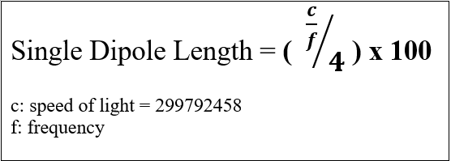

Antenna Length Equation
=======================

The Arduino program uses the following equation to calculate the length of a single dipole based on the desired frequency:

(The equation is multiplied by 100 to convert the length from meters to centimeters)

