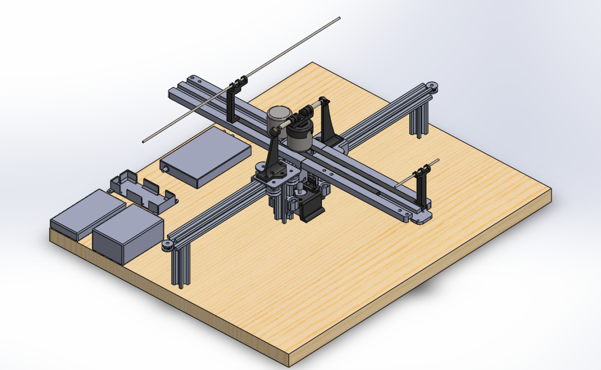
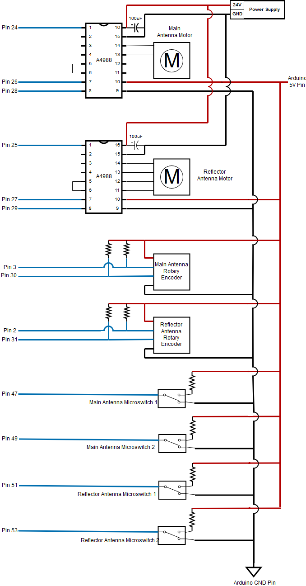

Hardware
========

1. Assembly
-----------
Completed Assembly
^^^^^^^^^^^^^^^^^^
This is what a completed assembly looks like:

Assembly Steps
^^^^^^^^^^^^^^

2. CAD Files
------------
Files can be accessed and downloaded `here <https://github.com/OcaJoy/AIConfigurableAntenna/tree/master/docs/source/slt>`_

Descriptions:
- Antenna mounting arms that hold the antenna end for extending and retracting

  | Antenna_Arms_-_Antenna_support_3-1.STL
  | Antenna_Arms_-_Antenna_support_4-1.STL

- The plate used by belt drive on a rail system to extend and retract the antenna. (x4)

  | Creality_X_Carriage_Plate.STL

- Channel used to guide small groups of wire into position

  | Wiring_Channel.STL

- Combination files of parts that make the V-wheel assembly that attaches to the Creality X Carriage Plate

  | assembled_v-wheel_-_bearing-1.STL
  | assembled_v-wheel_-_bearing-2.STL
  | assembled_v-wheel_-_spacerexternal-1.STL
  | assembled_v-wheel_-_spacerinner-1.STL
  | assembled_v-wheel_-_wheel-1.STL

- The long legs that hold the higher section of track. (x2)
 
  | V-Rail_long_leg.STL

- The legs that hold the lower section of track. (x2)

  | V-Rail_short_leg.STL

- The 27 cm sections of V-Rail that the Carriage Plate uses to guide the antennas. (x2)

  | V-Rail_track.STL

- These combine to make the fully assembled base of our antenna 

  | Assembled_antenna_2_-antenna_base-1.STL
  | Assembled_antenna_2_-antenna_base2-1.STL
  | Assembled_antenna_2_-antenna_base3-1.STL
  | Assembled_antenna_2_-antenna_base4-1.STL
  | Assembled_antenna_2_-antenna_base5-1.STL
  | Assembled_antenna_2_-antenna_base6-1.STL
  | Assembled_antenna_2_-antenna_base7-1.STL
  | Assembled_antenna_2_-antenna_nut-1.STL

- Stand-in model for the rotary encoders that we are using

  | rotary_encoder.STL
  
- Motor mount and reinforcing brace to attach to internals of long and short v-rail legs in the center of entire project

  | motor_bracket_brace.STL
  | motor_bracket_3.STL

- Similar to Antenna arms, these parts are for holding the 2 opposite pointing electret microphones in order to scan for sounds and sound origins

  | mic_support_1.STL [Main Holder] (x1)
  | mic_support_2.STL [Reflector Holders] (x2)
  | mic_support_3.STL [Main Holder (lowest sitting rail)] (x1)

- Mount that hold the two encoders 

  | encoder_mount2.STL

- Central antenna mount that attaches to the top of the central encoder, aligning the antennas with the holders

  | antenna_mount_and_encoder_cap.STL 

- Custom case of PCB to be mounted with the rest of the system

  | circuit_case.STL

- This track is for holding the new reflector system. (x2)

  | V-Rail_track_2.STL

- These legs hold the reflector system in place and will act as motor and microswitch mount. (x4)

  | V-Rail_Reflector_leg.STL

- These mounts are to hold microswitches for the homing function of the reflector supports. (x2)

  | Microswitch_mount_reflector.STL

- These mounts hold microswitches for homing the antenna supports. (x2)

  | Microswitch_mount.STL

- Motor mount that is attached to the reflector legs and holds the motor that drives the reflector

  | new_motor_mount.STL

- This mount is to hold and align the encoder and motor shaft for the reflector system 

  | encoder_mount_3.STL

- This encoder mount for antenna system

  | encoder_mount_4.STL

- Reflector Holders for the Reflector System. (x2)

  | Reflector_support_1.STL

- Brackets allow Raspberry Pi, HackRF, and our custom Circuit Case to be mounted in such a way as to be slid in and out of a mounting position

  | Circuit_case_holder.STL
  | Pi_holder.STL
  | hackRF_holder.STL

3. Electrical Components
------------------------
3.1 Circuit Components
^^^^^^^^^^^^^^^^^^^^^^
- `Pololu A4988 Motor Driver <https://www.pololu.com/product/1182>`_
- `Nema 17 Bi-polar 0.9 Degree Stepper Motor <https://www.omc-stepperonline.com/nema-17-bipolar-09deg-11ncm-156ozin-12a-36v-42x42x21mm-4-wires-17hm08-1204s.html>`_ [17HM08-1204S]
- `Incremental Photoelectric Rotary Encoder 400 P/R <https://www.dfrobot.com/wiki/index.php/Incremental_Photoelectric_Rotary_Encoder_-_400P/R_SKU:_SEN0230>`_ [SEN0230]
- SPDT Omron Microswitch

3.2 Software Defined Radio
^^^^^^^^^^^^^^^^^^^^^^^^^^
- `HackRF One Great Scott Gadgets <https://greatscottgadgets.com/hackrf/one/>`_

3.3 Power Supply
^^^^^^^^^^^^^^^^
- `AC/DC Adadpter - 24VDC 2.5A <https://www.circuittest.com/rpr-2402a5-p5.html>`_ [RPR-2402A5-P5]

4. Circuit Schematics
---------------------

5. Wiring Diagram
-----------------

