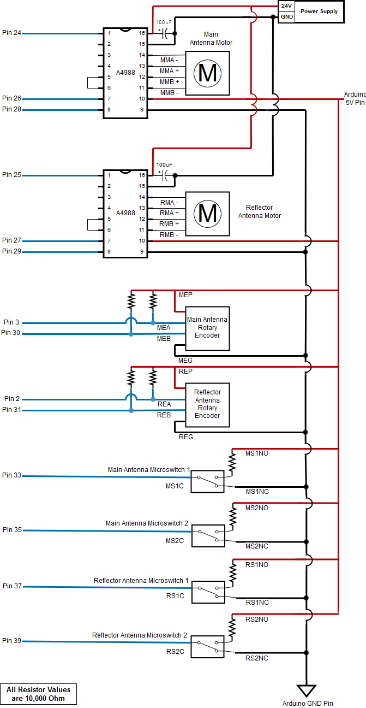

Hardware
========

1. Assembly
-----------
1.1. Completed Assembly
^^^^^^^^^^^^^^^^^^^^^^^
This is what a completed assembly looks like:

1.2. Assembly Steps
^^^^^^^^^^^^^^^^^^^

2. CAD Files
------------
2.1. Download
^^^^^^^^^^^^^ 
Files can be accessed and downloaded `here <https://github.com/OcaJoy/AIConfigurableAntenna/tree/master/docs/source/slt>`_

2.2. Descriptions
^^^^^^^^^^^^^^^^^

2.2.1. Antenna Holders
~~~~~~~~~~~~~~~~~~~~~~
- Mounting arms that hold the main antenna end for extending and retracting

  | `Antenna_Arms_-_Antenna_support_3-1.STL <https://github.com/OcaJoy/AIConfigurableAntenna/blob/master/docs/source/slt/Antenna%20Holders/Antenna_Arms_-_Antenna_support_3-1.STL>`_
  | `Antenna_Arms_-_Antenna_support_4-1.STL <https://github.com/OcaJoy/AIConfigurableAntenna/blob/master/docs/source/slt/Antenna%20Holders/Antenna_Arms_-_Antenna_support_4-1.STL>`_

- Reflector Antenna holders 

  | `Reflector_support_1.STL <https://github.com/OcaJoy/AIConfigurableAntenna/blob/master/docs/source/slt/Antenna%20Holders/Reflector_support_1.STL>`_

- Central mount that attaches to the top of the center encoder to hold the main anatennas

  | `antenna_mount_and_encoder_cap.STL <https://github.com/OcaJoy/AIConfigurableAntenna/blob/master/docs/source/slt/Antenna%20Holders/antenna_mount_and_encoder_cap.STL>`_

2.2.2. Bracket Holders
~~~~~~~~~~~~~~~~~~~~~~
- Bracket of Raspberry Pi that can be mounted by sliding in and out of a mounting position

  | `Pi_holder.STL <https://github.com/OcaJoy/AIConfigurableAntenna/blob/master/docs/source/slt/Bracket%20Holders/Pi_holder.STL>`_

- Bracket of HackRF that can be mounted by sliding in and out of a mounting position

  | `hackRF_holder.STL <https://github.com/OcaJoy/AIConfigurableAntenna/blob/master/docs/source/slt/Bracket%20Holders/hackRF_holder.STL>`_

2.2.3. Circuit Case
~~~~~~~~~~~~~~~~~~~
- Bracket of Circuit Case that can be mounted by sliding in and out of a mounting position

  | `Circuit_case_holder.STL <https://github.com/OcaJoy/AIConfigurableAntenna/blob/master/docs/source/slt/Circuit%20Case/Cuircuit_case_holder.STL>`_

- Custom case of PCB

  | `circuit_case.STL <https://github.com/OcaJoy/AIConfigurableAntenna/blob/master/docs/source/slt/Circuit%20Case/circuit_case.STL>`_

2.2.4. Encoder Mounts
~~~~~~~~~~~~~~~~~~~~~
- Reflector Encoder Mount

  | `encoder_mount_3.STL <https://github.com/OcaJoy/AIConfigurableAntenna/blob/master/docs/source/slt/Encoder%20Mounts/encoder_mount_3.STL>`_

- Main Antenna Encoder Mount

  | `encoder_mount_4.STL <https://github.com/OcaJoy/AIConfigurableAntenna/blob/master/docs/source/slt/Encoder%20Mounts/encoder_mount_4.STL>`_

2.2.5. Main Antenna Assembly
~~~~~~~~~~~~~~~~~~~~~~~~~~~~
- These combine to make a fully assembled base of the Main Antenna

  | `Assembled_antenna_2_-_antenna_base-1.STL <https://github.com/OcaJoy/AIConfigurableAntenna/blob/master/docs/source/slt/Main%20Antenna%20Assembly%20Parts/Assembled_antenna_2_-_antenna_base-1.STL>`_
  | `Assembled_antenna_2_-_antenna_base2-1.STL <https://github.com/OcaJoy/AIConfigurableAntenna/blob/master/docs/source/slt/Main%20Antenna%20Assembly%20Parts/Assembled_antenna_2_-_antenna_base2-1.STL>`_
  | `Assembled_antenna_2_-_antenna_base3-1.STL <https://github.com/OcaJoy/AIConfigurableAntenna/blob/master/docs/source/slt/Main%20Antenna%20Assembly%20Parts/Assembled_antenna_2_-_antenna_base3-1.STL>`_
  | `Assembled_antenna_2_-_antenna_base4-1.STL <https://github.com/OcaJoy/AIConfigurableAntenna/blob/master/docs/source/slt/Main%20Antenna%20Assembly%20Parts/Assembled_antenna_2_-_antenna_base4-1.STL>`_
  | `Assembled_antenna_2_-_antenna_base5-1.STL <https://github.com/OcaJoy/AIConfigurableAntenna/blob/master/docs/source/slt/Main%20Antenna%20Assembly%20Parts/Assembled_antenna_2_-_antenna_base5-1.STL>`_
  | `Assembled_antenna_2_-_antenna_base6-1.STL <https://github.com/OcaJoy/AIConfigurableAntenna/blob/master/docs/source/slt/Main%20Antenna%20Assembly%20Parts/Assembled_antenna_2_-_antenna_base6-1.STL>`_
  | `Assembled_antenna_2_-_antenna_base7-1.STL <https://github.com/OcaJoy/AIConfigurableAntenna/blob/master/docs/source/slt/Main%20Antenna%20Assembly%20Parts/Assembled_antenna_2_-_antenna_base7-1.STL>`_
  | `Assembled_antenna_2_-_antenna_nut-1.STL <https://github.com/OcaJoy/AIConfigurableAntenna/blob/master/docs/source/slt/Main%20Antenna%20Assembly%20Parts/Assembled_antenna_2_-_antenna_nut-1.STL>`_

2.2.6. Microphone Holders
~~~~~~~~~~~~~~~~~~~~~~~~~
- Similar to Antenna arms, these parts are for holding the 2 opposite pointing electret microphones in order to scan for sounds and sound origins

  | `mic_support_1.STL <https://github.com/OcaJoy/AIConfigurableAntenna/blob/master/docs/source/slt/Microphone%20Holders/mic_support_1.STL>`_ [Main Antenna Holder] (x1)
  | `mic_support_2.STL <https://github.com/OcaJoy/AIConfigurableAntenna/blob/master/docs/source/slt/Microphone%20Holders/mic_support_2.STL>`_ [Reflector Holders] (x2)
  | `mic_support_3.STL <https://github.com/OcaJoy/AIConfigurableAntenna/blob/master/docs/source/slt/Microphone%20Holders/mic_support_3.STL>`_ [Main Antenna Holder (lowest sitting rail)] (x1)

2.2.7. Microswitch Mounts
~~~~~~~~~~~~~~~~~~~~~~~~~
- These mounts hold the microswitches for homing function 

  | `Microswitch_mount.STL <https://github.com/OcaJoy/AIConfigurableAntenna/blob/master/docs/source/slt/Microswitch%20Mounts/Microswitch_mount.STL>`_ [Holders for Main Antenna Microswitches] (x2)
  | `Microswitch_mount_reflector.STL <https://github.com/OcaJoy/AIConfigurableAntenna/blob/master/docs/source/slt/Microswitch%20Mounts/Microswitch_mount_reflector.STL>`_ [Holders for Reflector Microswitches] (x2)

2.2.8. Motor Holders
~~~~~~~~~~~~~~~~~~~~
- These are for holding the motors in place

  | `motor_bracket_3.STL <https://github.com/OcaJoy/AIConfigurableAntenna/blob/master/docs/source/slt/Motor%20Holders/motor_bracket_3.STL>`_ [Main Antenna Motor Holder]
  | `new_motor_mount.STL <https://github.com/OcaJoy/AIConfigurableAntenna/blob/master/docs/source/slt/Motor%20Holders/new_motor_mount.STL>`_ [Reflector Antenna Motor Holder]

- Main Antenna Motor Brace that mounts the Main Antenna Motor Holder to the rail

  | `motor_bracket_brace.STL <https://github.com/OcaJoy/AIConfigurableAntenna/blob/master/docs/source/slt/Motor%20Holders/motor_bracket_brace.STL>`_

2.2.9. V-Rails
~~~~~~~~~~~~~~
- Longer legs that hold the higher section of the Main Antenna Track

  | `V-Rail_long_leg.STL <https://github.com/OcaJoy/AIConfigurableAntenna/blob/master/docs/source/slt/V%20Rails/V-Rail_long_leg.STL>`_ (x2)

- Shorter legs that hold the lower section of the Main Antenna Track

  | `V-Rail_short_leg.STL <https://github.com/OcaJoy/AIConfigurableAntenna/blob/master/docs/source/slt/V%20Rails/V-Rail_short_leg.STL>`_ (x2)

- V-Rail that the Carriage Plate uses to guide the Main Antennas (27 cm)

  | `V-Rail_track.STL <https://github.com/OcaJoy/AIConfigurableAntenna/blob/master/docs/source/slt/V%20Rails/V-Rail_track.STL>`_ (x2)

- Legs that hold the Reflector Antenna Track and will act as motor and microswitch mounting

  | `V-Rail_Reflector_leg.STL <https://github.com/OcaJoy/AIConfigurableAntenna/blob/master/docs/source/slt/V%20Rails/V-Rail_Reflector_leg.STL>`_ (x4)

- V-Rail that the Carriage Plate uses to guide the Reflector Antennas

  | `V_Rail_track_2.STL <https://github.com/OcaJoy/AIConfigurableAntenna/blob/master/docs/source/slt/V%20Rails/V-Rail_track_2.STL>`_ (x2)

2.2.10. V-Wheel Assembly
~~~~~~~~~~~~~~~~~~~~~~~~
- Creality X Carriage Plate (the plate used by the belt drive on the rail systems to move the antennas)

  | `Creality_X_Carriage_Plate.STL <https://github.com/OcaJoy/AIConfigurableAntenna/blob/master/docs/source/slt/V%20Wheel%20Assembly%20Parts/Creality_X_Carriage_Plate.STL>`_ (x4)

- These parts combines with the Creality X Carriage Plate to create the complete V-Wheel Assembly

  | `assembled_v-wheel_-_bearing-1.STL <https://github.com/OcaJoy/AIConfigurableAntenna/blob/master/docs/source/slt/V%20Wheel%20Assembly%20Parts/assembled_v-wheel_-_bearing-1.STL>`_
  | `assembled_v-wheel_-_bearing-2.STL <https://github.com/OcaJoy/AIConfigurableAntenna/blob/master/docs/source/slt/V%20Wheel%20Assembly%20Parts/assembled_v-wheel_-_bearing-2.STL>`_
  | `assembled_v-wheel_-_spacerexternal-1.STL <https://github.com/OcaJoy/AIConfigurableAntenna/blob/master/docs/source/slt/V%20Wheel%20Assembly%20Parts/assembled_v-wheel_-_spacerexternal-1.STL>`_
  | `assembled_v-wheel_-_spacerinner-1.STL <https://github.com/OcaJoy/AIConfigurableAntenna/blob/master/docs/source/slt/V%20Wheel%20Assembly%20Parts/assembled_v-wheel_-_spacerinner-1.STL>`_
  | `assembled_v-wheel_-_wheel-1.STL <https://github.com/OcaJoy/AIConfigurableAntenna/blob/master/docs/source/slt/V%20Wheel%20Assembly%20Parts/assembled_v-wheel_-_wheel-1.STL>`_

2.2.11. Wiring Channel
~~~~~~~~~~~~~~~~~~~~~~
- Channel that guides small groups of wire into position

  | `Wiring_Channel.STL <https://github.com/OcaJoy/AIConfigurableAntenna/blob/master/docs/source/slt/Wiring_Channel.STL>`_

2.2.12. Rotary Encoder
~~~~~~~~~~~~~~~~~~~~~~
- Stand-in model for the rotary encoders being used

  | `rotary_encoder.STL <https://github.com/OcaJoy/AIConfigurableAntenna/blob/master/docs/source/slt/rotary_encoder.STL>`_ 

3. Electrical Components
------------------------
3.1 Circuit Components
^^^^^^^^^^^^^^^^^^^^^^
- `Pololu A4988 Motor Driver <https://www.pololu.com/product/1182>`_
- `Nema 17 Bi-polar 0.9 Degree Stepper Motor <https://www.omc-stepperonline.com/nema-17-bipolar-09deg-11ncm-156ozin-12a-36v-42x42x21mm-4-wires-17hm08-1204s.html>`_ [17HM08-1204S]
- `Incremental Photoelectric Rotary Encoder 400 P/R <https://www.dfrobot.com/wiki/index.php/Incremental_Photoelectric_Rotary_Encoder_-_400P/R_SKU:_SEN0230>`_ [SEN0230]
- `SPDT Omron Microswitch <>`_

3.2 Software Defined Radio
^^^^^^^^^^^^^^^^^^^^^^^^^^
- `HackRF One Great Scott Gadgets <https://greatscottgadgets.com/hackrf/one/>`_

3.3 Power Supply
^^^^^^^^^^^^^^^^
- `AC/DC Adadpter - 24VDC 2.5A <https://www.circuittest.com/rpr-2402a5-p5.html>`_ [RPR-2402A5-P5]

4. Circuit Diagrams
-------------------
4.1. Label Definition
^^^^^^^^^^^^^^^^^^^^^
+------------+------------------------------------------------------------+
| Label Name |                         Description:                       |
+============+============================================================+
|    MMA -   | Main Antenna Motor Coil 1 Negative Lead (Black)            |
+------------+------------------------------------------------------------+
|    MMA +   | Main Antenna Motor Coil 1 Positive Lead (Green)            |
+------------+------------------------------------------------------------+
|    MMB +   | Main Antenna Motor Coil 2 Positive Lead (Red)              |
+------------+------------------------------------------------------------+
|    MMB -   | Main Antenna Motor Coil 2 Negative Lead (Blue)             |
+------------+------------------------------------------------------------+
|    RMA -   | Reflector Antenna Motor Coil 1 Negative Lead (Black)       |
+------------+------------------------------------------------------------+
|    RMA +   | Reflector Antenna Motor Coil 1 Positive Lead (Greed)       |
+------------+------------------------------------------------------------+
|    RMB +   | Reflector Antenna Motor Coil 2 Positive Lead (Red)         |
+------------+------------------------------------------------------------+
|    RMB -   | Reflector Antenna Motor Coil 2 Negative Lead (Blue)        |
+------------+------------------------------------------------------------+
|    MEP     | Main Antenna Encoder Power Pin (White)                     |
+------------+------------------------------------------------------------+
|    MEA     | Main Antenna Encoder A Pin (Red)                           |
+------------+------------------------------------------------------------+
|    MEB     | Main Antenna Encoder B Pin (Green)                         |
+------------+------------------------------------------------------------+
|    MEG     | Main Antenna Encoder Ground Pin (Black)                    |
+------------+------------------------------------------------------------+
|    REP     | Reflector Antenna Encoder Power Pin (White)                |
+------------+------------------------------------------------------------+
|    REA     | Reflector Antenna Encoder A Pin (Red)                      | 
+------------+------------------------------------------------------------+
|    REB     | Reflector Antenna Encoder B Pin (Green)                    |
+------------+------------------------------------------------------------+
|    REG     | Reflector Antenna Encoder Ground Pin (Black)               |
+------------+------------------------------------------------------------+
|    MS1NO   | Main Antenna Microswitch 1 Normally Open Contact           |
+------------+------------------------------------------------------------+
|    MS1NC   | Main Antenna Microswitch 1 Normally Closed Contact         |
+------------+------------------------------------------------------------+
|    MS1C    | Main Antenna Microswitch 1 Common Contact                  |
+------------+------------------------------------------------------------+
|    MS2NO   | Main Antenna Microswitch 2 Normally Open Contact           |
+------------+------------------------------------------------------------+
|    MS2NC   | Main Antenna Microswitch 2 Normally Closed Contact         |
+------------+------------------------------------------------------------+
|    MS2C    | Main Antenna Microswitch 2 Common Contact                  |
+------------+------------------------------------------------------------+
|    RS1NO   | Reflector Antenna Microswitch 1 Normally Open Contact      |
+------------+------------------------------------------------------------+
|    RS1NC   | Reflector Antenna Microswitch 1 Normally Closed Contact    |
+------------+------------------------------------------------------------+
|    RS1C    | Reflector Antenna Microswitch 1 Common Contact             |
+------------+------------------------------------------------------------+
|    RS2NO   | Reflector Antenna Microswitch 2 Normally Open Contact      |
+------------+------------------------------------------------------------+
|    RS2NC   | Reflector Antenna Microswitch 2 Normally Closed Contact    |
+------------+------------------------------------------------------------+
|    RS2C    | Reflector Antenna Microswitch 2 Common Contact             |
+------------+------------------------------------------------------------+

4.2. Circuit Schematics
^^^^^^^^^^^^^^^^^^^^^^^

4.3. Wiring Diagram
^^^^^^^^^^^^^^^^^^^

