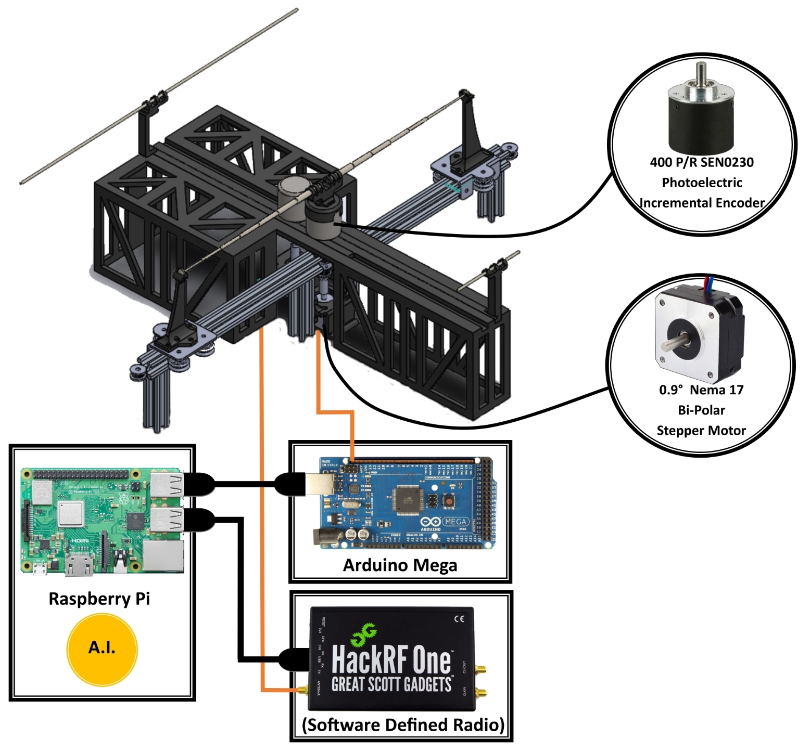

Welcome to AIConfigurableAntenna's documentation!
=================================================

Description
-----------
The AI Configurable Antenna is an configurable dipole antenna with reflector antennas that are automated by the AI. 

The AI resides in the Raspberry Pi and sends instructions to the Arduino Mega that controls the extention and retraction of the dipole antenna and the reflector antennas. The behaviour of the antenna is received through HackRF which is connected to the Raspberry Pi to be analyzed by the AI.
  

GitHub
------
`https://github.com/OcaJoy/AIConfigurableAntenna <https://github.com/OcaJoy/AIConfigurableAntenna>`_ 

Start Up
--------
1. Connect the power of the circuit board.
2. Connect the Arduino the Raspberry Pi.
3. Run the Raspberry Pi Software. 

Contents
--------

.. toctree::
   :maxdepth: 3
   :glob:
   
   antennaspec
   modesofoperation
   antennaequation
   hardware
   software
   team

